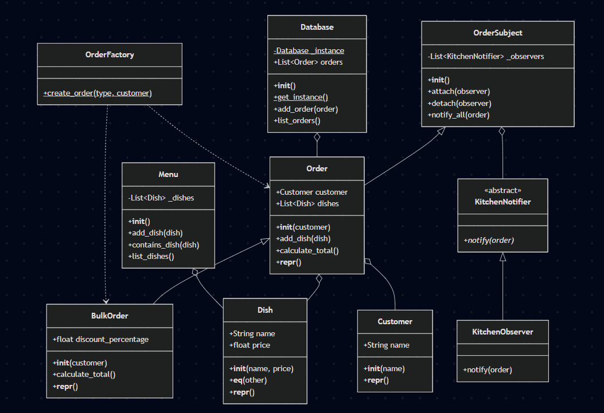

# Restaurant Order Management System

## Class Structure and SOLID Principles

### Class Structure
The project implements a Restaurant Order Management System with the following key classes:

1. **Model Classes**:
   - `Customer`: Represents a customer with a name
   - `Dish`: Represents a menu item with name and price
   - `Menu`: Manages a collection of dishes
   - `Order`: Represents a standard order with customer and dishes
   - `BulkOrder`: Extends Order to include discount functionality

2. **Pattern Implementation Classes**:
   - `OrderFactory`: Creates different types of orders
   - `OrderSubject`: Base class for the observer pattern
   - `KitchenNotifier`: Abstract observer interface
   - `KitchenObserver`: Concrete observer implementation
   - `Database`: Singleton database for storing orders

### SOLID Principles Used

1. **Single Responsibility Principle (SRP)**:
   - Each class has a single responsibility:
     - `Dish` manages dish information
     - `Menu` manages a collection of dishes
     - `Order` manages order information
     - `Database` handles order storage
     - `KitchenObserver` handles notifications

2. **Open/Closed Principle (OCP)**:
   - Classes are open for extension but closed for modification:
     - `Order` is extended by `BulkOrder` without modifying the base class
     - New observers can be added without changing `OrderSubject`

3. **Liskov Substitution Principle (LSP)**:
   - Subtypes can be used in place of their parent types:
     - `BulkOrder` can be used anywhere an `Order` is expected
     - Any implementation of `KitchenNotifier` can be used where the interface is expected

4. **Interface Segregation Principle (ISP)**:
   - Interfaces are focused and minimal:
     - `KitchenNotifier` has only the necessary `notify` method
     - Classes don't implement methods they don't use

5. **Dependency Inversion Principle (DIP)**:
   - High-level modules depend on abstractions:
     - `Order` depends on the `KitchenNotifier` interface, not concrete implementations
     - `OrderFactory` creates objects based on abstractions

## Tests in the Project

The project includes comprehensive tests for all components:

1. **Model Tests** (`test_models.py`):
   - Tests basic model functionality
   - Verifies dish creation and properties
   - Tests menu operations (add, contains, list)
   - Verifies customer creation

2. **Order Tests** (`test_order.py`):
   - Tests order creation and management
   - Verifies adding dishes to orders
   - Tests total calculation for standard orders
   - Tests bulk order creation with discount
   - Verifies custom discount functionality
   - Tests edge cases like empty orders

3. **Factory Tests** (`test_factory.py`):
   - Tests the OrderFactory pattern
   - Verifies creation of standard and bulk orders
   - Tests case-insensitive order type handling
   - Tests default behavior for unknown types
   - Verifies error handling for null values

4. **Observer Tests** (`test_observer.py`):
   - Tests the Observer pattern
   - Verifies attaching and detaching observers
   - Tests notification when dishes are added
   - Verifies multiple observers receive notifications
   - Tests the concrete KitchenObserver implementation

5. **Singleton Tests** (`test_singleton.py`):
   - Tests the Singleton pattern
   - Verifies that only one database instance exists
   - Tests adding and listing orders in the database
   - Verifies persistence between different instance references
   - Tests constructor exception for multiple instantiations

6. **Edge Case Tests** (`test_edge_cases.py`):
   - Tests various edge cases
   - Verifies dish equality and inequality
   - Tests menu contains functionality with similar dishes
   - Tests orders with negative prices
   - Tests bulk orders with zero or 100% discount

7. **System Tests** (`test_system.py`):
   - Tests the full system flow
   - Verifies integration between components
   - Tests the main application functionality

## Test-Driven Development (TDD) Approach

This project was developed using Test-Driven Development (TDD), following these steps:

1. **Write Tests First**:
   - Tests were written before implementing the actual functionality
   - For example, `test_factory.py` defined the expected behavior of the OrderFactory before it was implemented

2. **Red-Green-Refactor Cycle**:
   - **Red**: Tests were initially failing because the functionality wasn't implemented
   - **Green**: Minimal code was written to make the tests pass
   - **Refactor**: Code was improved while ensuring tests still passed

3. **Incremental Development**:
   - The project was built incrementally, starting with basic models
   - Each component was tested in isolation before integration
   - For example, the Order class was tested thoroughly before implementing BulkOrder

4. **Test Coverage**:
   - Tests cover normal operation, edge cases, and error conditions
   - For example, `test_edge_cases.py` tests unusual scenarios like negative prices

5. **Regression Prevention**:
   - The comprehensive test suite ensures that new changes don't break existing functionality
   - For example, changes to the Order class would be caught if they broke BulkOrder functionality

## Design Patterns Used

### 1. Singleton Pattern
- **Implementation**: `Database` class in `patterns/database.py`
- **Purpose**: Ensures only one instance of the database exists throughout the application
- **Usage**: Used to store and retrieve orders
- **Key Features**:
  - Private class variable `_instance` to track the singleton instance
  - Static method `get_instance()` to access the singleton
  - Constructor that prevents multiple instantiations

### 2. Observer Pattern
- **Implementation**: `OrderSubject` class in `patterns/observer.py` and `KitchenObserver` class in `notifier/kitchen_notifier.py`
- **Purpose**: Allows objects (observers) to be notified when the state of another object (subject) changes
- **Usage**: Notifies the kitchen when a new dish is added to an order
- **Key Features**:
  - Abstract `KitchenNotifier` class defining the observer interface
  - `OrderSubject` class with methods to attach, detach, and notify observers
  - Concrete `KitchenObserver` implementation that prints notifications

### 3. Factory Pattern
- **Implementation**: `OrderFactory` class in `patterns/order_factory.py`
- **Purpose**: Creates different types of orders without exposing the instantiation logic
- **Usage**: Creates standard or bulk orders based on the specified type
- **Key Features**:
  - Static method `create_order()` that returns different order types
  - Support for case-insensitive order types
  - Error handling for null values

## UML Diagram
